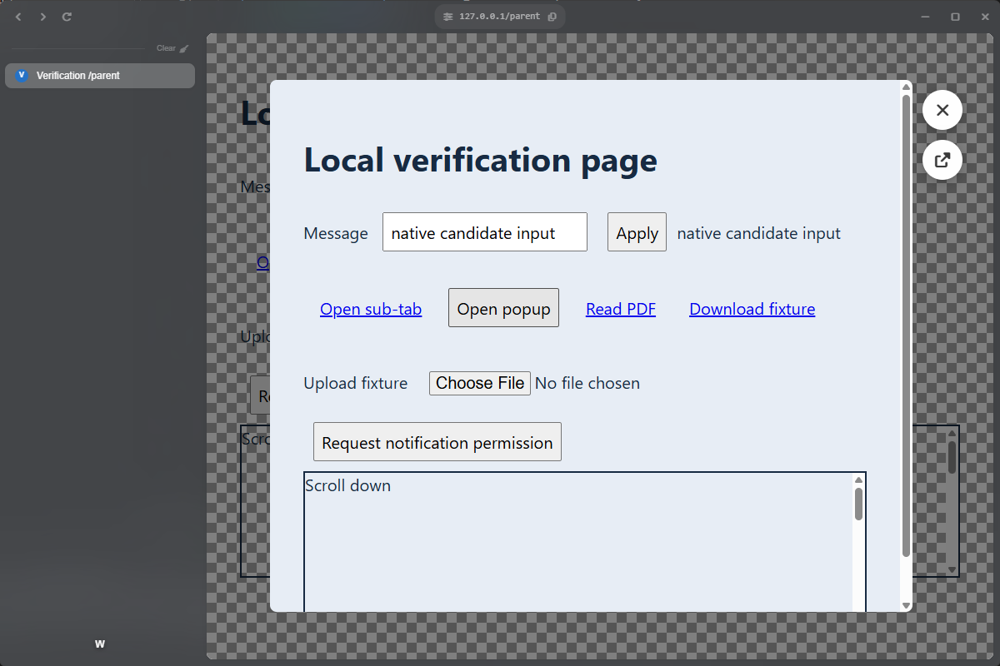
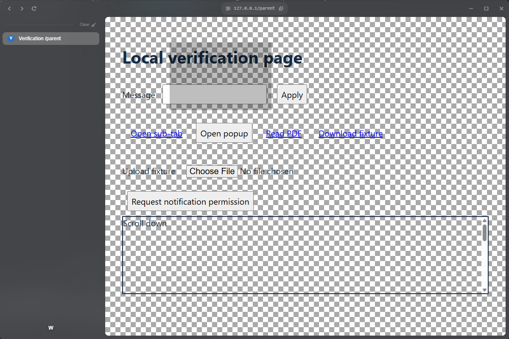
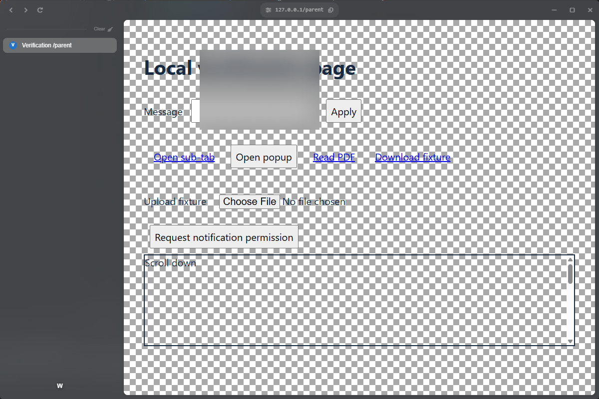

# Native view animation and blur evaluation (issue #42)

## Decision

Retain the bounds-animation fallback and existing glass/backdrop presentation on
Electron 44.3.0. The native animation candidate reduces JavaScript bounds calls,
but a resize during animation is overwritten by its old destination. Native blur
works within one window's compositor tree; it does not blur the parent page
through Chiaroscuro's separate transparent sub-tab window. Neither candidate meets
the existing behavior well enough to ship as a replacement.

The fallback now cancels on resize, hide, detach and close, resolves cancelled
promises, starts interrupted exits at the displayed bounds, and skips animation
for reduced motion. Per-parent operation ordering protects rapid open/close and
promotion. The backdrop also resolves interrupted promises and prevents a stale
hide from making a newly shown overlay click-through. Closing waits for native
WebContents destruction; a prevented unload keeps the child in its stack and
restores the visible overlay. If the parent is already closed, a vetoing child is
adopted as a standalone tab before its sub-tab ownership record is removed.

## Environment and reproduction

Measured September 12, 2026 with Electron 44.3.0, native Windows, an isolated
AppSession, the real shell/parent WebContentsView/sub-tab BrowserWindow/child
WebContentsView, and the local fixture site. Runs use Chromium's
`--force-device-scale-factor=1` and `1.5`; Electron reported display scale factors
1 and 1.5. This checks DIP rounding and compositor scaling, not moving a window
between physical monitors or changing the user's Windows display preferences.
The interrupted-bounds failure also reproduced on Linux under WSLg.

```bash
bun run verify:app:win --native-views  # from WSL; builds and runs on Windows
# In a native Windows checkout, after bun run build:
bun run diagnose:native-views
# Linux desktop/WSLg:
CHIAROSCURO_HEADED=1 bun run diagnose:native-views
```

The optional diagnostic writes `test-results/native-views/scale-{1,1.5}/`, mirrored
to `test-results/windows/native-views/` by the Windows launcher. Each directory
contains `animation.json`, runtime/display metadata, composed screenshots for
blur radii 0 and 20, the ordinary app evidence bundle, and a Playwright trace.
Candidate incompatibility is recorded as an observation, not disguised as a
passing production regression. Launch/capture errors still fail the diagnostic.

## Bounds and load comparison

The candidate calls `view.setBounds(full, { animate: { duration: 200, easing:
"ease-out" } })` from smaller centered bounds. At 60 ms, it applies a smaller
window-layout result using ordinary `setBounds(resized)`, then reads the result
after the original animation has finished.

| Forced scale | Requested resize (DIP) | Bounds after native completion (DIP) |
| --- | --- | --- |
| 1 | x=76, y=56, width=651, height=539 | x=76, y=56, width=771, height=639 |
| 1.5 | x=76, y=48, width=653, height=444 | x=76, y=48, width=773, height=544 |

`getBounds()` also reported the expanded underlying view size at the start and
middle of the native entry; it did not expose the animated layer's displayed
rectangle. Simply feeding it into a reversed transition cannot reproduce the
fallback's interrupted geometry.

For load comparison, the diagnostic blocks main-process JavaScript for 220 ms
after approximately 64 ms of a 200 ms transition. It records bounds calls and
`bounds-changed` observations for the old 16 ms timer and native API:

| Forced scale | Mode | Bounds calls, idle / loaded | Last logical bounds change, idle / loaded |
| --- | --- | --- | --- |
| 1 | Timer | 9 / 5 | 209 / 297 ms |
| 1 | Native | 1 / 1 | 214 / 306 ms |
| 1.5 | Timer | 9 / 5 | 188 / 297 ms |
| 1.5 | Native | 1 / 1 | 214 / 306 ms |

These are one-run diagnostic samples, not performance thresholds. Rounded timer
bounds can reach the destination before the timer's final tick. Native animation
clearly removes per-frame JavaScript calls, but logical completion still waits on
the main process. This does **not** measure compositor frame rate or establish
perceptual smoothness during a stall; a desktop video would be needed for that.
The resize regression is sufficient to reject adoption even with that potential
benefit. No native completion/cancellation API is exposed to replace the existing
lifecycle contract cleanly.

## Blur against the real layered windows

The parent fixture uses a high-contrast checkerboard to expose blur. The diagnostic
sets a translucent native background on the existing sub-tab window's content
view, then compares native blur radii 0 and 20. It preserves the actual dimmed
backdrop, native child content, rounded corners and action buttons.

At both scales the parent checkerboard/text remained sharp behind the sub-tab
window. At scale 1 the radius-0 and radius-20 PNGs were byte-identical. The scale
1.5 captures likewise showed no parent blur (their complete desktop crops were
not byte-identical). This does not replace the app's CSS glass effects.



A positive control closes the sub-tab and puts a translucent native View above
the parent WebContentsView **in the same shell window**. Radius 20 visibly blurs
both checkerboard and text, establishing that native blur itself works on this
Windows renderer:





Adopting blur for sub-tabs would require a different window/compositor layout,
including renewed focus, hit-testing and stacking verification. That architectural
change is not a drop-in improvement to the current glass design.

## Regression coverage

`src/platform/tab-bounds-animation.test.ts` covers timing, geometry, reversal,
cancellation and zero-duration bounds. Feature tests cover overlapping open/close
operations and parent destruction during backdrop entry.
`e2e/scenarios/sub-tab-transitions.spec.ts` exercises visible nested links, input
focus, resize, rapid close/reopen, and reduced-motion/cancelled backdrop promises.
The existing cross-window scenario retains popup and parent-focus coverage.
The design-system example honors reduced motion for frame/backdrop and buttons.

## API references

- [Electron 42 release: native view animations and blur](https://www.electronjs.org/blog/electron-42-0)
- [View API](https://www.electronjs.org/docs/latest/api/view)
- [Pinned Electron 44.3.0 implementation](https://github.com/electron/electron/blob/v44.3.0/shell/browser/api/electron_api_view.cc): the resize branch animates layer bounds/clipping and later writes its captured final view bounds.
